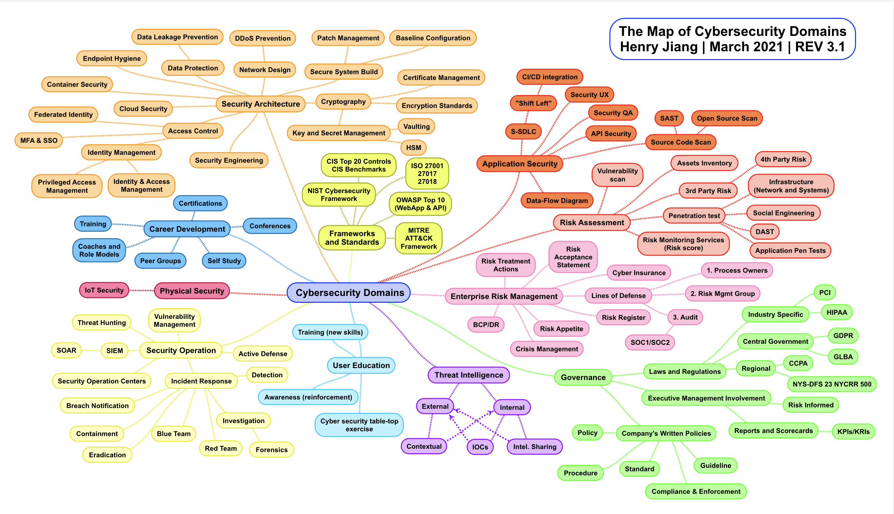

# CyberSecurityCareerGuide
This is a collection of helpful information for people wanting to get started in cyber security.

CyberSecurity is a vast field with a lot of disparet pathways. The mind map below highlights some of the optiosn to help direct your career path. 

